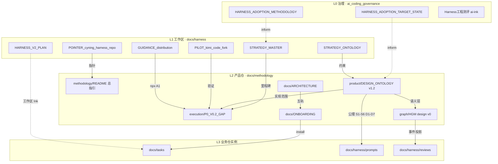

# 文档关系图 · Harness 方法论（v1）

| 项 | 内容 |
| --- | --- |
| **状态** | `active` |
| **日期** | 2026-06-15 |
| **用途** | 归档 **谁引用谁** · 真值在哪 · 避免复制漂移 |
| **维护** | 增删 L2 文档时同步更新 §2 矩阵 |

---

## 1. 总览（Mermaid）

---

## 2. 文档矩阵

| 文档 | 层 | 仓库路径 | 角色 | 直接依赖 |
| --- | --- | --- | --- | --- |
| HARNESS_ADOPTION_METHODOLOGY | L0 | `ai_coding_governance/methodology/harness/` | 推广方法论过程态 | — |
| HARNESS_ADOPTION_TARGET_STATE | L0 | 同上 | 目标态 | METHODOLOGY |
| STRATEGY_MASTER | L1 | `docs/harness/guides/` | 路线真值 · A/B/C 轨 | STRATEGY_ONTOLOGY |
| STRATEGY_ONTOLOGY | L1 | 同上 | 战略本体 · push 清单 | DESIGN_ONTOLOGY |
| HARNESS_V2_PLAN | L1 | `docs/harness/` | Ink 工作区 Harness 规划 | AGENTS.md §8 |
| PILOT_kimi_code_fork | L1 | `docs/harness/guides/` | kimi-code-meta 试点 | ONBOARDING · wizard |
| GUIDANCE_distribution | L1 | 同上 | npx / ctx / MCP | STRATEGY_MASTER |
| **ROADMAP v1.1** | L2 | `methodology/` | **产品 semver · Track G** | STRATEGY_MASTER · ONTOLOGY |
| **AUDIT doc consistency** | L2 | `methodology/` | 一致性审计归档 | PROMPT_doc_consistency_audit |
| **methodology/README** | L2 | `cyning-harness/docs/methodology/` | **总指引** | 本文件 |
| **DESIGN_ONTOLOGY v1.2** | L2 | `methodology/product/` | **产品语义真值** | ARCHITECTURE · templates |
| **P0_V0.2_GAP** | L2 | `methodology/execution/` | 实现差距 · 演示命令 | ONTOLOGY §0.2 |
| **HGM design v0** | L2 | `methodology/graph/` | 图+事件远期 | ONTOLOGY v1.2 |
| HGM dialogue archive | L2 | `methodology/graph/` | 参考 · 非真值 | HGM design |
| ARCHITECTURE | L2 | `docs/` | 五轨物理结构 | — |
| ONBOARDING | L2 | `docs/` | 接入 UX | wizard |
| demo_checkout | L2 | `examples/` | P0 金样 | P0 · ACCEPTANCE |

---

## 3. POINTER 规则

| 规则 | 说明 |
| --- | --- |
| **真值唯一** | L2 全文只在 `methodology/product|graph|execution/` |
| **根目录 POINTER** | `docs/DESIGN_ONTOLOGY_v1_zh.md` 等短 POINTER · 兼容旧链 |
| **工作区 POINTER** | `docs/harness/guides/POINTER_*` → L2 路径 |
| **禁止** | 在 POINTER 中复制 L2 全文 |

---

## 4. 版本锚点（2026-06-15）

| 文档 | 版本 |
| --- | --- |
| DESIGN_ONTOLOGY | v1.2 · draft |
| ROADMAP | v1.1 · active |
| HGM design | v0.1 · proposal |
| STRATEGY_ONTOLOGY | v1.1 · active（L1 · 工作区） |
| P0 gap | active |
| methodology README | v1.1 |
| 一致性审计 | [`AUDIT_doc_consistency_2026-06-15_zh.md`](./AUDIT_doc_consistency_2026-06-15_zh.md) |

---

## 5. 修订记录

| 日期 | 说明 |
| --- | --- |
| 2026-06-15 | 初版关系图 · 归集 methodology/ 后 |
| 2026-06-15 | §4 版本锚点同步 v1.1 · 补 ROADMAP · 审计报告链 |
