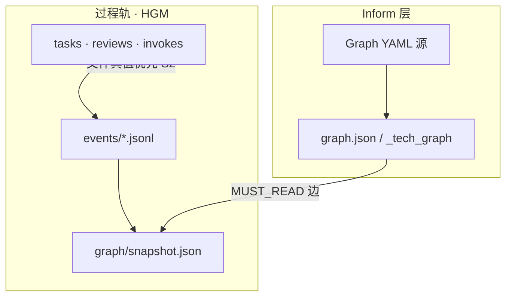

# HGM 升级方案 · 讨论大纲 v1

| 项 | 内容 |
| --- | --- |
| **状态** | `outline` · **待维护者逐节讨论签收** |
| **版本** | v1.0 |
| **日期** | 2026-06-16 |
| **性质** | Track G **立项前**方案大纲 · 非实现规格 |
| **设计真值（已有）** | [`HARNESS_GRAPH_MODEL_design_v0_zh.md`](./HARNESS_GRAPH_MODEL_design_v0_zh.md) |
| **语义真值** | [`../product/DESIGN_ONTOLOGY_v1_zh.md`](../product/DESIGN_ONTOLOGY_v1_zh.md) v1.2 |
| **L2 路线** | [`../ROADMAP_v1_zh.md`](../ROADMAP_v1_zh.md) §2.2 · §8 |
| **编排 task** | 工作区 [`task_cyning_harness_g1_hgm_v2_v1.md`](../../../../docs/harness/tasks/active/task_cyning_harness_g1_hgm_v2_v1.md) |

> **一句话**：HGM = 过程轨 **Task / Gate / Hat / Review** 的显式图 + append-only 事件；**不替代** Markdown 真值 · **不替代** Inform 架构图谱。

---

## 0. 维护者决策摘要（2026-06-16）

| # | 决策 | 含义 |
| --- | --- | --- |
| D1 | **后端 Graph YAML P0 关账后再开 HGM G1** | Ink 后端 `graph-yaml-p0-00-main` 验证 schema/编译/CI 口径 · HGM 不抢跑 |
| D2 | **产品 Inform-YAML 在 v2.0 前并入主轨** | 后端试点后 · 将 YAML 能力升进 `@cyning/harness` **v1.1+** · 避免 2.x 再迁一次 Inform 格式 |
| D3 | **B9 Agent-shell 后置** | 排在 **HGM G1** 与 **cyning-harness-agent** 基础齐全之后 · 非 v1.0 并行项 |
| D4 | **v1.0 公众号稿本周完成发布** | 见 D 轨 [`ARTICLE_纪律包_v1.0_stable_公众号_v1_zh.md`](../../../../ai_coding_governance/narrative/discipline_package_series/ARTICLE_纪律包_v1.0_stable_公众号_v1_zh.md) |
| D5 | **本大纲 = G1 讨论入口** | 各节 `[讨论]` / `[待定]` 逐轮闭合后再写 G1 task 30 帽实现规格 |

---

## 1. 总体依赖链（Post-v1.0）

```text
【本周 P0/P1】
  A5 v1.0.1（CLI verify/gate-check） ──► Epic CLOSE（HG-EPIC-ROADMAP）
  D 轨 v1.0 公众号稿通读 + 发布

【Inform 层 · 先于 HGM 产品 ingest】
  Ink 后端 graph-yaml-p0-00-main（P0 试点 CLOSE）
       │
       ▼
  产品 Track I-YAML（@cyning/harness v1.1+ · gate-check / InformArtifact 对齐）
       │
       ▼
【Track G · HGM】
  G0 事件 schema 冻结 + 讨论大纲签收（本文件）
       │
       ▼
  G1 v2.0：ingest · snapshot · axioms check 子集
       │
       ▼
  G2 v2.1+：timeline · SQLite · patterns（可选）

【Track B · 后置】
  cyning-harness-agent 基础（Track C 提案 · 待单独立项）
       │
       ▼
  B9 Agent-shell findings（第二 DistributionChannel · ≤4h/周）
```

**硬约束**：HGM **不得**在 YAML P0 未关账时写「InformArtifact 已统一 YAML」；对外 **不得**把 YAML 试点称作「HGM 已上线」。

---

## 2. 三轨「图」边界（讨论必读）

| 轨 | 名称 | 管什么 | semver / task | 与 HGM 关系 |
| --- | --- | --- | --- | --- |
| **Inform · GraphTrack** | 架构图谱 | 模块/流程/入口 · `_tech_graph/` | 业务仓 + v1.0 `gate-check --graph` | HGM 节点 `InformArtifact` **引用** 此轨产物 |
| **Inform · YAML** | Graph Source v3 | flowchart 编辑源 · YAML→MD/JSON | 后端 P0 → 产品 v1.1+ [`task_y1`](../../../../docs/harness/tasks/active/task_cyning_harness_y1_yaml_inform_v19_v1.md) | 为 InformArtifact 提供 **稳定 machine-readable 源** · **非**过程事件 |
| **Track G · HGM** | 过程协作图 | Task–Gate–Hat–Review 实例 + 事件史 | v2.0+ G1 [`task_g1`](../../../../docs/harness/tasks/active/task_cyning_harness_g1_hgm_v2_v1.md) | **本大纲主题** |



---

## 3. G1（v2.0）MVP 范围 · 建议包络

> 细节见 design v0 · 本节只列 **G1 必达 / 明确不做**，供讨论勾选。

### 3.1 G1 必达（proposal · 待讨论签收）

| 能力 | 交付物 | 验收口径（草案） |
| --- | --- | --- |
| **事件写入** | `.cyning-harness/events/YYYY-MM.jsonl` | append-only · 幂等 ingest |
| **ingest CLI** | `harness graph ingest --from-repo .` | 扫描 tasks/reviews/invokes/gate-check.log · 不碰 S2 覆盖 |
| **snapshot** | `harness graph snapshot` → `graph/snapshot.json` | 事件重放可 rebuild · 可删缓存 |
| **公理子集** | `harness graph axioms check` | **至少** D2 · D3 · rejected→draft · S2 事件审计 |
| **与 gate-check 并列** | 文档 + README | `--graph` 仍指 **Inform** · HGM 子命令独立 |

### 3.2 G1 明确不做

- Neo4j / 远端图库默认后端
- OWL 推理机 · GrowingReasoningAgent
- 用图 DB **覆盖** task/review 正文
- Supabase 同步（Q3 in design v0 · 维持 **否**）
- Agent-shell / Runtime（Track C / B9）

### 3.3 `[讨论]` G1 是否包含 InformArtifact 自动 ingest？

| 选项 |  pros | cons |
| --- | --- | --- |
| **A · G1 仅过程节点** | 范围小 · 与 YAML 产品轨解耦 | Inform 与过程图需两次 ingest |
| **B · G1 含 InformArtifact 指针** | `MUST_READ` 边可机械检查 | 依赖 Track I-YAML schema 冻结 |

**维护者暂定**：**B** — 但 **Inform 正文仍来自 YAML/MD 真值** · HGM 只存 `inform:{path}` 节点与 `MUST_READ` 边 · 等 I-YAML v1.1 后再实现 B 的细节。

---

## 4. 分阶段交付（Track G 内部分解）

| 阶段 | 代号 | npm / 标签 | 核心交付 | 闸门 |
| --- | --- | --- | --- | --- |
| **G0** | schema 冻结 | —（文档） | 本大纲签收 · `events` JSON Schema · 与 ontology 公理 ID 对照表 | YAML P0 CLOSE + 大纲 §3–§6 讨论闭合 |
| **G1** | ingest MVP | **v2.0.0** | §3.1 必达 | G0 + I-YAML v1.1 最小对齐（InformArtifact 路径约定） |
| **G2** | 查询加速 | v2.1.x | timeline · SQLite 投影 · 简单 filter query | G1 dogfood 30 天 |
| **G3** | 模式统计 | v2.2+ | patterns · 可选 Neo4j 导出 | G2 + 事件量足够 |

**`[讨论]`** v2.0.0 是否允许 **仅 ingest + snapshot**、axioms check 放 v2.0.1？  
**草案倾向**：axioms check **至少 D2 一条** 须跟 v2.0.0 同发，否则「图论公理」叙事空洞。

---

## 5. 事件 schema · 讨论清单

> 完整示例见 design v0 §1.3 · 此处列 **待决字段**。

| ID | 问题 | 草案 | 待决 |
| --- | --- | --- | --- |
| E1 | ingest 触发 | v2.0 **手动 CLI** + gate-check 结束 hook **可选** | hook 是否默认开？ |
| E2 | `actor` 枚举 | `maintainer \| gate-check \| sync \| agent:{hat_id}` | 是否加 `ci`？ |
| E3 | 修正历史 | 仅 `CorrectionEvent` 追加 · 禁止删改 | 是否需要 `supersedes` 边？ |
| E4 | Epic 节点 | Epic = Task 特化标签 `Epic` | 与现有 Epic task md 字段对齐表 **待写** |
| E5 | Inform 变更 | 是否发 `InformArtifactUpdated`？ | **待定** · 可能仅 gate-check --graph 触发 |
| E6 | 多仓 | 单仓 `.cyning-harness/events` | 工作区根聚合 **v2.2+** |

**G0 交付**：`docs/methodology/graph/schemas/hgm_event_v1.schema.json`（待建）+ 与 §5 表同步的 CHANGELOG。

---

## 6. 与 Track I-YAML（产品 v1.1+）的接口

| 接口 | HGM 侧 | I-YAML 侧 |
| --- | --- | --- |
| **节点 ID** | `inform:{repo_rel_path}` | YAML 编译产物路径写入 manifest |
| **mustRead** | Task → InformArtifact 边 | task 表 `must_read` 或 gate-check 解析 |
| **校验** | ingest 时检查路径存在 | `graph yaml compile` + diff graph.json |
| **版本** | 事件带 `inform_schema: v3` 可选字段 | P0 后端 schema 冻结后 **复制/抽象** 到产品仓 |

**目的（D2）**：v2.0 开 ingest 时 Inform 已是 YAML 友好 · **避免 2.x 再改 Inform 物理格式**。

关联 task：[`task_cyning_harness_y1_yaml_inform_v19_v1.md`](../../../../docs/harness/tasks/active/task_cyning_harness_y1_yaml_inform_v19_v1.md)

---

## 7. CLI 与 semver 纪律

| 命令域 | v1.x | v2.x |
| --- | --- | --- |
| `init` / `upgrade` / `audit` / `verify` / `gate-check` | 主轨持续 patch/minor | 行为兼容 · 无破坏性改 S2 |
| `gate-check --graph` | **Inform** 模块图 | 不变语义 |
| `graph ingest` / `graph snapshot` / `graph axioms` | **不存在** | **G1 新增** |

SEM-02 维持：**主轨 v1.x · HGM 从 v2.0 主版本起** · 不写「v0.5 = HGM」。

---

## 8. B9 · cyning-harness-agent · Track C

| 项 | 说明 |
| --- | --- |
| **cyning-harness-agent** | **未立项** · 预期 = 基于纪律包的 Agent 分发/Runtime 壳（Track C 子集）· 消费 HGM 事件与 gate-check |
| **B9** | Kimi ExecutionShell 第二通道实验 · **依赖** agent 基础 + HGM ingest 可观测 |
| **顺序** | I-YAML v1.1 → HGM G1 v2.0 → **agent 基础 task** → B9 findings |
| **叙事** | 主路径仍为 **repo + npx** · shell 通道永不单独宣传「不必 embed」 |

`[讨论]` cyning-harness-agent 是独立 npm 包还是 `@cyning/harness` 可选 preset？**待定** · 建议 Epic 后单独 STRATEGY 一页。

---

## 9. 文档与公众稿分层

| 文档 | 时机 | 注意 |
| --- | --- | --- |
| v1.0 公众号稿 | **本周** | 不写 HGM 已上线 · 可预告 Track G |
| 续篇 **篇 2 HGM** | G0 大纲签收 + v1.0 稿发布后 | 沿用 [`OUTLINE_续篇_两篇_v1_zh.md`](../../../../ai_coding_governance/narrative/discipline_package_series/OUTLINE_续篇_两篇_v1_zh.md) §4 |
| design v0 → v1 | G1 开发前 | 本大纲讨论结论 **回写** design 文件 |
| USER_GUIDE v2.0 | G1 npm 发布时 | 新增 `graph` 子命令章 |

---

## 10. 开放问题（下一轮讨论议程）

1. **G1 axioms 最小集**：仅 D2+D3+rejected→draft，还是含 D4-a（Inform 模块闸）？
2. **ingest 与 git**：是否 v2.0 提供 optional pre-commit ingest？
3. **工作区多子仓**：Projects 根是否需 `harness graph ingest --workspace`（推迟 G2/G3？）
4. **I-YAML schema 归谁**：产品仓 canonical vs 业务仓试点先行 · **倾向** 试点冻结 → 产品抽象 → 写回 governance methodology
5. **bench S5**：rejected→draft 夹具是否并入 compliance-bench 与 HGM axioms **同一口径**？
6. **agent 立项触发**：G1 dogfood 绿 + 维护者书面批 Track C 子 task

---

## 11. 关联索引

| 类型 | 路径 |
| --- | --- |
| Post-v1.0 序列表 | [`POST_V1_0_SEQUENCE_v1_zh.md`](../../../../docs/harness/guides/POST_V1_0_SEQUENCE_v1_zh.md) |
| 后端 YAML P0 | [`task_engineering_graph_yaml_p0_00_main_v1.md`](../../../../ai-ink-brain-api-python/docs/tasks/active/task_engineering_graph_yaml_p0_00_main_v1.md) |
| 产品 I-YAML | [`task_cyning_harness_y1_yaml_inform_v19_v1.md`](../../../../docs/harness/tasks/active/task_cyning_harness_y1_yaml_inform_v19_v1.md) |
| HGM G1 task | [`task_cyning_harness_g1_hgm_v2_v1.md`](../../../../docs/harness/tasks/active/task_cyning_harness_g1_hgm_v2_v1.md) |
| B9（后置） | [`task_cyning_harness_b9_agent_shell_v1.md`](../../../../docs/harness/tasks/active/task_cyning_harness_b9_agent_shell_v1.md) |
| A5 v1.0.1 | [`task_cyning_harness_a5_cli_verify_v101_v1.md`](../../../../docs/harness/tasks/active/task_cyning_harness_a5_cli_verify_v101_v1.md) |

---

## 12. 讨论签收（维护者）

| 节 | 状态 | 签收人 | 日期 |
| --- | --- | --- | --- |
| §0 决策摘要 | `confirmed` | （维护者 2026-06-16 口头） | |
| §3 G1 范围 | `pending` | | |
| §5 事件 schema | `pending` | | |
| §6 I-YAML 接口 | `pending` | | |
| §8 agent/B9 | `pending` | | |
| **G0 整体** | `pending` | 全表勾选后开 G1 30 帽 | |

---

## 修订记录

| 版本 | 日期 | 说明 |
| --- | --- | --- |
| v1.0 | 2026-06-16 | 维护者五项决策落盘 · G0 讨论大纲初版 |
