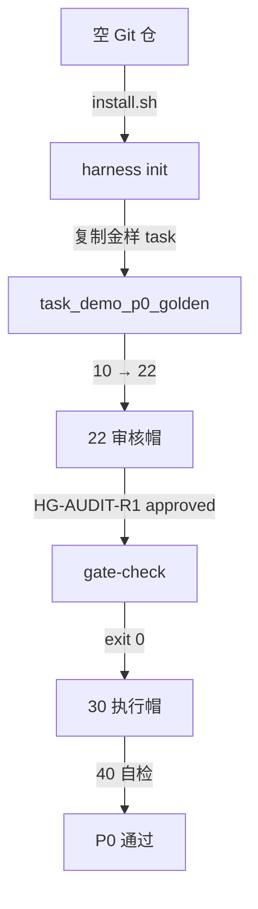

# Harness P0 金样流程

demo_checkout 最小 SDD 闭环流程图

## Mermaid

## Structured Data

### Nodes

| ID | Label | Kind |
|----|-------|------|
| START | 空 Git 仓 |  |
| INIT | harness init |  |
| TASK | task_demo_p0_golden |  |
| R1 | 22 审核帽 |  |
| GATE | gate-check |  |
| EXEC | 30 执行帽 |  |
| DONE | P0 通过 |  |

### Edges

| From | To | Mark | Type | Label | Anchors |
|------|----|------|------|-------|---------|
| START | INIT | -> | depends_on | install.sh |  |
| INIT | TASK | -> | depends_on | 复制金样 task |  |
| TASK | R1 | -> | depends_on | 10 → 22 |  |
| R1 | GATE | -> | depends_on | HG-AUDIT-R1 approved |  |
| GATE | EXEC | -> | depends_on | exit 0 |  |
| EXEC | DONE | -> | depends_on | 40 自检 |  |

## Sub-graph Links

- `Struct`: [`01_struct.md`](01_struct.md)（手写 · 无 `.graph.yaml`）
- `Version`: [`02_version.md`](02_version.md)（手写 · 无 `.graph.yaml`）
- 子图编辑源见 `docs/_tech_graph/*.graph.yaml`

