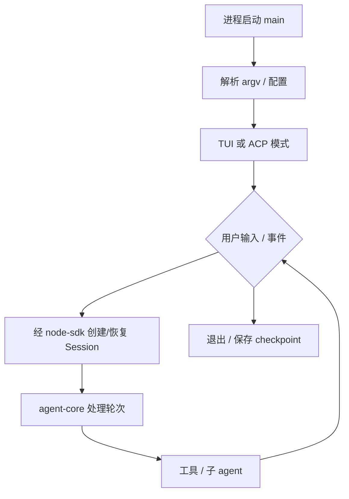

# Flow：CLI 会话主循环（骨架 · 待增量）

> **状态**：`skeleton` — 阶段 B 占位；细节在 **阶段 C** 或首张触达 `apps/kimi-code` 的 task 中补全。  
> **双轨**：待补 `10_flow_cli_session.ai.md`（与本文语义对齐后再建）。

## 待补锚点（阶段 C）

- [ ] `apps/kimi-code/src/main.ts` 入口
- [ ] Session 创建与 resume 路径
- [ ] 与 `packages/agent-core` 边界调用点
