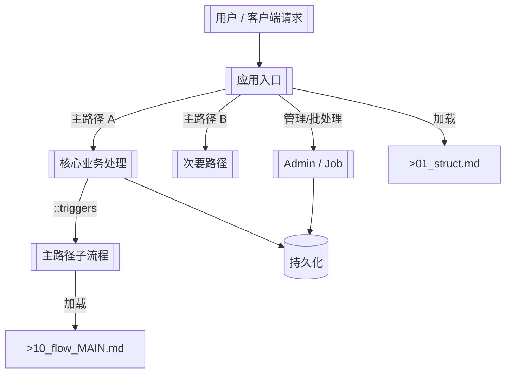

# 顶层流程总图

> 模板包主入口分发与典型子流程路由

> **源文件**：`00_main.graph.yaml` · 由 `scripts/graph_yaml_compile.js` 生成 · 请勿直接手写本文件

## Nodes

| ID | Label |
|----|-------|
| Q | 用户 / 客户端请求 |
| E | 应用入口 |
| M1 | 核心业务处理 |
| M2 | 次要路径 |
| ADM | Admin / Job |
| FLOW_MAIN | 主路径子流程 |
| FLOW_DOC | >10_flow_MAIN.md |
| DB | 持久化 |
| STRUCT_DOC | >01_struct.md |

## Edges

| From | To | Label | Type | Anchors |
|------|----|-------|------|---------|
| Q | E | -> |  | src/main.py#L1, app/router/index.ts#L1 |
| E | M1 | 主路径 A |  | handlers/resource.py::handle_create |
| E | M2 | 主路径 B |  | handlers/health.py::health_check |
| E | ADM | 管理/批处理 |  | jobs/ingest.py::run_sync |
| M1 | FLOW_MAIN | ::triggers | triggers |  |
| FLOW_MAIN | FLOW_DOC | 加载 |  |  |
| M1 | DB | -> |  | db/repository.py |
| ADM | DB | -> |  | db/repository.py |
| E | STRUCT_DOC | 加载 |  |  |
