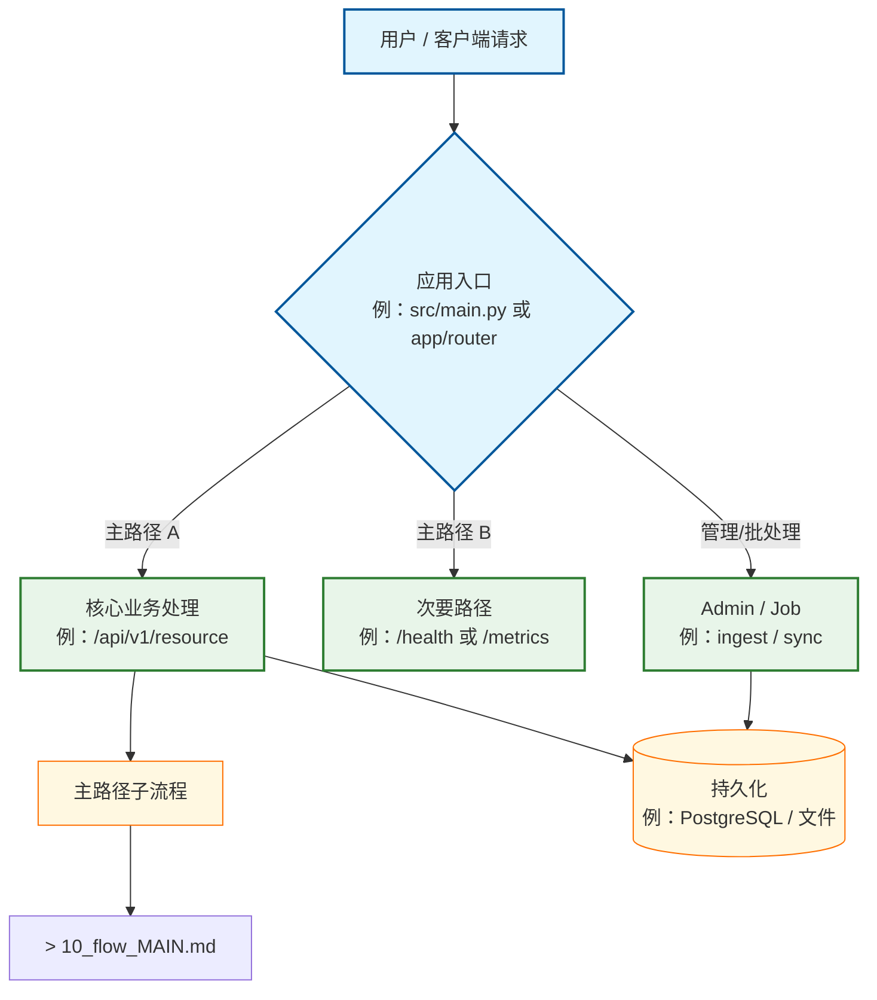

# 顶层流程总图（人类友好版）

> **用途**：`docs/_tech_graph/00_main.md` — 本仓 **Happy Path** 主干；子流程折叠为 `10_flow_*.md` 链接。  
> **双轨**：须与 [`00_main.ai.md`](./00_main.ai.md) 语义等价；flowchart 改 `.ai.md` 优先，再同步本文件。  
> **协议**：[`99_mermaid_protocol.md`](./99_mermaid_protocol.md)

## 维护说明

1. 替换下方占位节点为你的 **真实入口**（HTTP 路由 / CLI / 事件总线等）。
2. 子图节点 > 7 时折叠为 `[[Phase]]`，链至独立 `10_flow_*.md`。
3. 异常分支可挂侧链；主干保持可读。

## 待补 flow 清单（存量 S2+ 可用）

| flow 文件 | 状态 | 说明 |
|-----------|------|------|
| `10_flow_MAIN.md` | 示例已提供 | 主请求路径；嵌入后替换为真实 API/页面流 |
| `10_flow_*.md` | 待增量 | 每 Epic 或跨模块改动时补 1 张 |

## 关联

- 模块边界：[`01_struct.md`](./01_struct.md)（**HG-GRAPH-MODULES** 人签真值）
- 拓扑协议：[`99_mermaid_protocol.md`](./99_mermaid_protocol.md)
