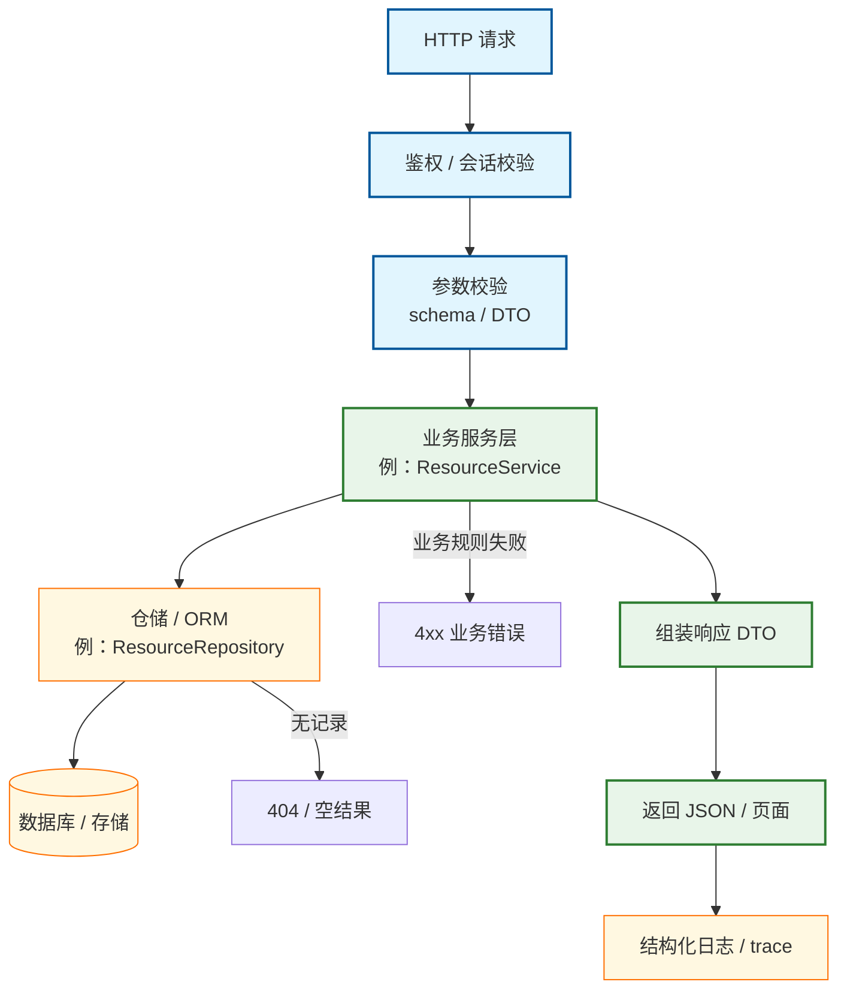

# 主路径 Flow 示例（人类友好版）

> **用途**：`docs/_tech_graph/10_flow_MAIN.md` — **至少 1 条**主业务流（新仓 / S0 必做）。  
> **双轨**：须与 [`10_flow_MAIN.ai.md`](./10_flow_MAIN.ai.md) 语义等价。  
> **嵌入后**：将占位路径替换为真实 handler / 路由 / 页面流。

## 与顶层图关系

- 在 [`00_main.md`](./00_main.md) 中由 `M1` 或等价节点 **加载** 本文件。
- 模块归属见 [`01_struct.md`](./01_struct.md) 中 `api` / `core` 等行。

## 增量维护

改 BFF / API 契约时：**同 task** 更新本 flow 或另开图谱子 task；Harness 关账 ≠ 图谱关账。
