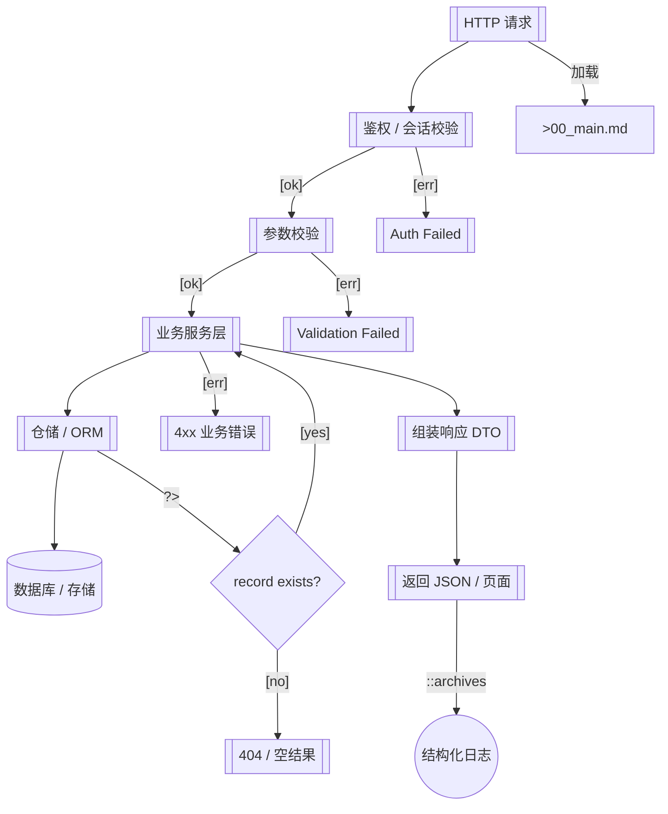

# 主路径 Flow 示例

> 典型 HTTP 请求从入口到响应的主干流程

> **源文件**：`10_flow_MAIN.graph.yaml` · 由 `scripts/graph_yaml_compile.js` 生成 · 请勿直接手写本文件

## Nodes

| ID | Label |
|----|-------|
| IN | HTTP 请求 |
| AUTH | 鉴权 / 会话校验 |
| VAL | 参数校验 |
| SVC | 业务服务层 |
| ERR_AUTH | Auth Failed |
| ERR_VAL | Validation Failed |
| REPO | 仓储 / ORM |
| DB | 数据库 / 存储 |
| HIT | record exists? |
| NOTFOUND | 404 / 空结果 |
| BIZERR | 4xx 业务错误 |
| RESP | 组装响应 DTO |
| OUT | 返回 JSON / 页面 |
| LOG | 结构化日志 |
| MAIN_DOC | >00_main.md |

## Edges

| From | To | Label | Type | Anchors |
|------|----|-------|------|---------|
| IN | AUTH | -> |  | middleware/auth.py::require_user |
| AUTH | VAL | [ok] |  |  |
| AUTH | ERR_AUTH | [err] |  | middleware/auth.py#L42 |
| VAL | SVC | [ok] |  | services/resource_service.py::handle |
| VAL | ERR_VAL | [err] |  |  |
| SVC | REPO | -> |  | repositories/resource_repo.py::find_by_id |
| REPO | DB | -> |  | db/session.py |
| REPO | HIT | ?> |  |  |
| HIT | NOTFOUND | [no] |  |  |
| HIT | SVC | [yes] |  |  |
| SVC | BIZERR | [err] |  | services/resource_service.py |
| SVC | RESP | -> |  |  |
| RESP | OUT | -> |  | handlers/resource.py::to_response |
| OUT | LOG | ::archives | archives | observability/logger.py |
| IN | MAIN_DOC | 加载 |  |  |
